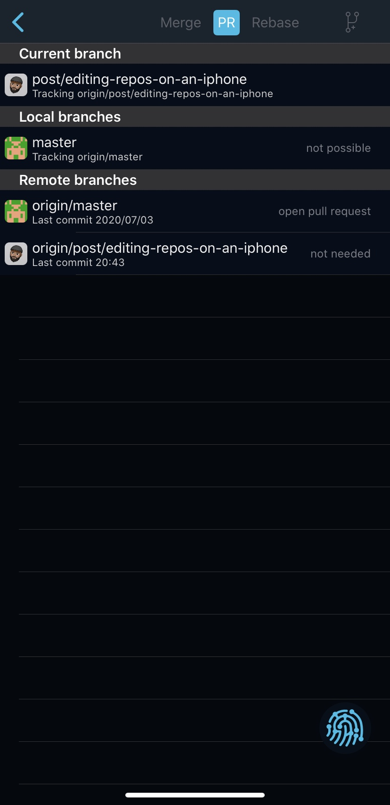

We are truly living in the future folks!

Or, I may have been living under a rock. 

Seriously, I never thought this would be possible on iOS/iPhone. But with some initial setup it is!

So without further ado, this is how I managed to write and deploy this post using only my iPhone. 

# Apps Used
- [Working Copy][1] - Git client
- [Textastic][2]- Text editor with syntax highlighting 
- [Canva][3]- Image editing and templating

# Workflow

In Working Copy I linked my GitHub account and cloned my blog repo. My blog is written in Gatsby and uses [gatsby-remark-transformer][4] to convert Markdown to what you see now. So in Working Copy I navigated to my `posts` directory and created a new directory. Within that directory I created an empty `index.md`file. 

Next I opened up Canva and created an empty template of 1500px150px (by post banner) and created a quick banner. If you've never used Canva before, they have some very cool stock photos and templates. 

![Canva][image-1]

Then in the Files app I enabled Working Copy as a location. Next, in Textastic added an `External Folder` and chose my blog repo. Great! Now I can edit files directly in Textastic and the changes will reflect in Working Copy! Nifty. 

Next I started writing this blog post. Text was easy enough. For images I first took the screenshots I wanted and saved them to my Photos. Then in Working Copy, under the correct directory I clicked the “plus” icon on the top right and imported the images. Then it's a simple matter of renaming them properly and referencing them as you normally would in a Markdown file. 

Now one thing I was missing from this workflow was the ability to do a `yarn develop` to preview my post locally. However, I use Netlify to deploy and host my blog and I make use their [Deploy Previews][5] feature. Essentially whenever I open up a PR on GitHub, Netlify automatically builds and deploy a _preview_ of that branch. 

But how can I create a PR from my iPhone? Again Working Copy to the rescue! First I created a branch, committed my changes and pushed them. Then under `Branches > Show all branches` I clicked the “pr” button and then clicked the branch I wanted to merge my changes into. Working Copy shows your a nice diff view and you can add a title and description for your PR as you normally would! 

After creating the PR I opened up the official GitHub app and viewed my open PR. Clicking on “checks” show the following. As you can see Netlify deployed a preview version of my blog. Clicking that check will open it up in your browser. Now I can preview my changes without exposing the world to the dodgy spelling and grammar of my first draft!

To fix anything all I had to do was edit the files/images and push changes. Since the PR was still open, Netlify will automatically pick up and deploy these changes to the preview site. Pretty cool!

Once I was happy I merged the PR into master. Now of course, Netlify will deploy these changes to the live version of my site. 

#  Improvements 

The workflow worked pretty well overall but there are some things I would like to improve. 

- Textastic doesn't have a spell check. It's tough to do any kind of writing without this. I want to check out any of the Markdown editors on the AppStore. [Ulysses][7] looks good!
- I wish there was a cleaner way to reference images in the Markdown file. Right now I have to import the images into Working Copy, rename them, copy the path and paste them into the Markdown file.

# Conclusion

Overall, I'm happy with this type of workflow for small/quick editing. Obviously this doesn't beat a fully fledged development environment. And I miss Vim/Emacs! I would image this type of workflow can be extended to iPadOS. It could probably be improved significantly even paired with the keyboard/touchbar case. I could try deploy a VM somewhere (a Digital Ocean droplet perhaps) with all my tooling installed (vim/emacs/tmux etc) and have a nice Mosh session going from a terminal client ([Blink Shell][8] looks good here).

Do you have a better workflow? Do something similar for on-the-go editing? Let me know in the comments!

That's it for now folks! Thanks for reading. 

Peace ✌🏽

[1]:	https://apps.apple.com/za/app/working-copy-git-client/id896694807
[2]:	https://apps.apple.com/za/app/textastic-code-editor-9/id1049254261
[3]:	https://apps.apple.com/za/app/canva-card-poster-logo-maker/id897446215
[4]:	https://www.gatsbyjs.org/packages/gatsby-transformer-remark/
[5]:	https://docs.netlify.com/site-deploys/overview/#deploy-preview-controls
[6]:	working-copy-pr.png "Creating a PR in Working Copy"
[7]:	https://apps.apple.com/za/app/ulysses/id1225571038
[8]:	https://apps.apple.com/za/app/blink-shell-mosh-ssh-client/id1156707581

[image-1]:	canva-screenshot.png