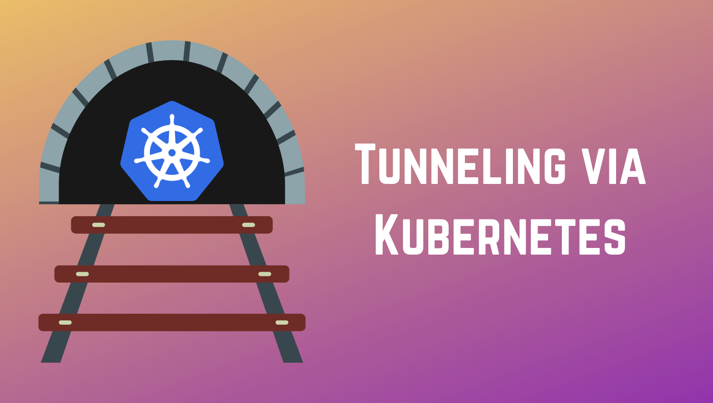

For security reasons, you might find your database (or any service for that matter) in an internal subnet, somewhere in the cloud. Accessing this for local debugging/development can be a pain.

Using Kubernetes (assuming you have a cluster already), you can use this to your advantage.

What you need:

1.  Kubernetes (with API access via Kubectl ofcourse)
2.  An image with netcat installed (Nice opportunity to punt [mine](https://rameezkhan.me/debug-on-kubernetes-with-a-swiss-army-knife-of-tools/) 😉)
3.  [tcpserver](https://manpages.debian.org/testing/ucspi-tcp/tcpserver.1.en.html) (should come with any Debian based distro)
