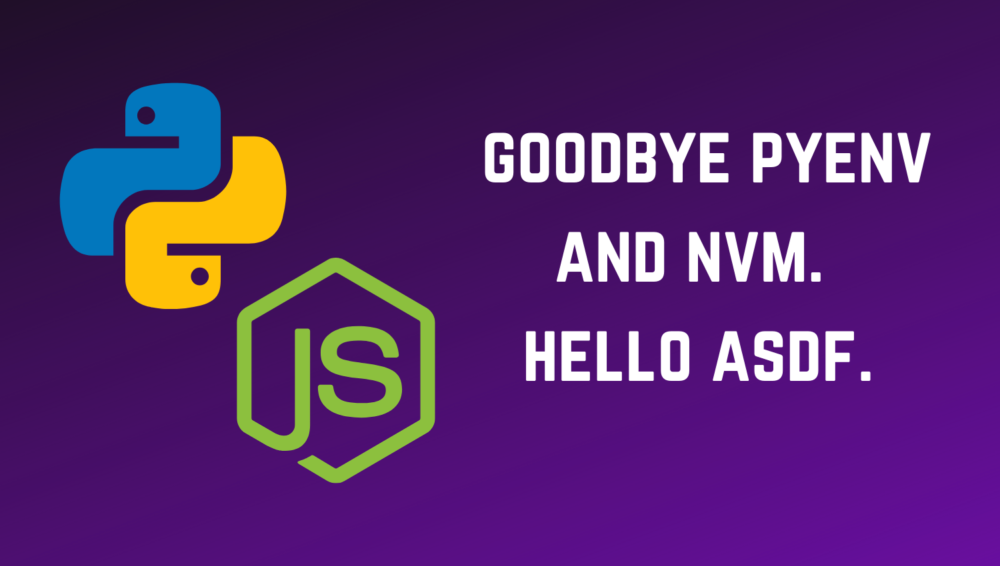

## pyenv and nvm
I maintain several side-projects, most of which are either Python or Node.js. For the longest time I used (pyenv)[https://github.com/pyenv/pyenv] and (nvm)[https://github.com/nvm-sh/nvm] to manage different versions of Python and Node.js respectively.

The configuration to manage these would be added to my (dotfiles)[https://github.com/rameezk/dotfiles/]. Over time, my shell (zsh) startup times increased significantly to the point where it took roughly 3 seconds. I spend most of my life at the terminal, so this was insufferable. 

After some investigation I found that this was mainly attributed to nvm. 

## Hello ASDF

Then I found (ASDF)[https://github.com/asdf-vm/asdf]. The tagline reads:

> Manage multiple runtime versions with a single CLI tool, extendable via plugins

Sounds good! 

Also, let me take this moment to praise the ASDF project for its stellar documentation! Concise and easy to understand. This is how all project documentation should be!

After (installing ASDF)[https://asdf-vm.com/#/core-manage-asdf?id=install] (have I mentioned the documentation is really good?), I added the Python and Node.js plugins. 

```bash
asdf plugin-add python
asdf plugin-add nodejs
```

Next, install the runtime of your choice.

```bash
asdf install python 3.9.0
asdf install nodejs 12.19.0
```

You can then set them to be /global/ with.

```bash
asdf global python 3.9.0
asdf global nodejs 12.19.0
```

Lastly ensure ASDF's path is added to your `PATH`. Also `fpath` for some convenient completions.

```bash
. $HOME/.asdf/asdf.sh
fpath=(${ASDF_DIR}/completions $fpath)
```

Running `which node` will show how the ASDF /shim/ works. Similar to pyenv.

```
$ which node
/home/rameezk/.asdf/shims/node
```

ASDF has replaced all runtime managers for me now. I not only use it for Python and Node.js, but now also for Golang, Ruby and Java.

If you use multiple tools to manage all of these, then I would strongly suggest you check out the ASDF project to simplify your tooling setup a bit. And maintain some sanity!
