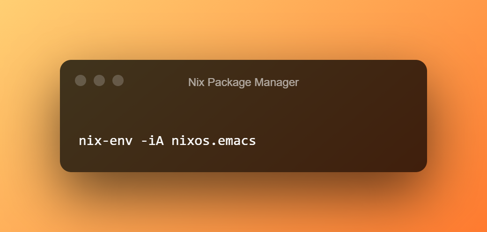

## Linuxbrew

Coming from a MacBook, I become comfortable with [Homebrew](https://brew.sh/) as a package manager. 

Over time, I built up a collection of tools in my [dotfiles](https://github.com/rameezk/dotfiles) to maximise my productivity.

When moving over to Ubuntu, I realized a couple of these tools were missing from Apt. Naturally I went with something I was most
comfortable with, in this case, [Linuxbrew](https://docs.brew.sh/Homebrew-on-Linux).

Linuxbrew works. It's just your normal Homebrew on Linux. On the rare occasion, you'll find an unsupported package. But nothing 
you can't manually install.

Still, parts of what Linuxbrew offered annoyed me.
- It felt slow (unpredictable command times)
- It wasn't 100% predictable (on my journey of learning Clojure and functional paradigms, side effects are a red flag for me)
- Packages were not sandboxed (one package's dependencies shared another package's sub dependencies etc)
- `brew update` sometimes breaks all the things

## Nix

I then came across [Nix](https://nixos.org/). The tag line reads...

_"Nix is a tool that takes a unique approach to package management and system configuration. Learn how to make reproducible, 
declarative and reliable systems."_

Sounds good? Indeed.

The learning curve is steep. As a beginner your friend is the [cheatsheet](https://nixos.wiki/wiki/Cheatsheet). That, and a lot
of Duck'ing. Is _Duck'ing_ a thing yet? Fine, Googling if you will.

Without getting too much into the nitty gritty, here are a couple of commands.

### Installing a package
```bash
nix-env -iA git
```

### Uninstalling a package
```bash
nix-env -e git
```
**NOTE:** It is important to note, that Nix doesn't remove the package from your system yet since you might want to roll-back. It just gets removed
from your path. All "erased" packages are only truly removed when you run `nix-collect-garbage`. 

### Listing installed packages
```bash
nix-env --query --installed
```

## Verdict

So does Nix trump Linuxbrew? 

For me at least, I think it's too soon to make a sound judgement. I am still very much in the beginning stages of exploring the Nix
ecosystem. I probably would not give Nix the recommendation it deserves. 

If Linuxbrew works for you, then by all means, continue to use it! I'm still on my journey to building my ideal developer environment paradise.

So far, I've found the benefits to be.
- Packages are completely sandboxed
- You can install specific version of packages (as long as these are still maintained in something called a Nix Channel)
- Predictable command times (Linuxbrew)

In another post I'll go into more of the details surrounding `nix-shell`. Paired with [direnv](https://direnv.net/), this makes [asdf](https://asdf-vm.com/#/)
almost obsolete. The gist of it is that you can have different versions of Python, Terraform, NodeJS, you name it, localized per directory. Very cool!

So far, at least, I'll continue down this path. Perhaps that ideal developer environment paradise is just around the next corner.