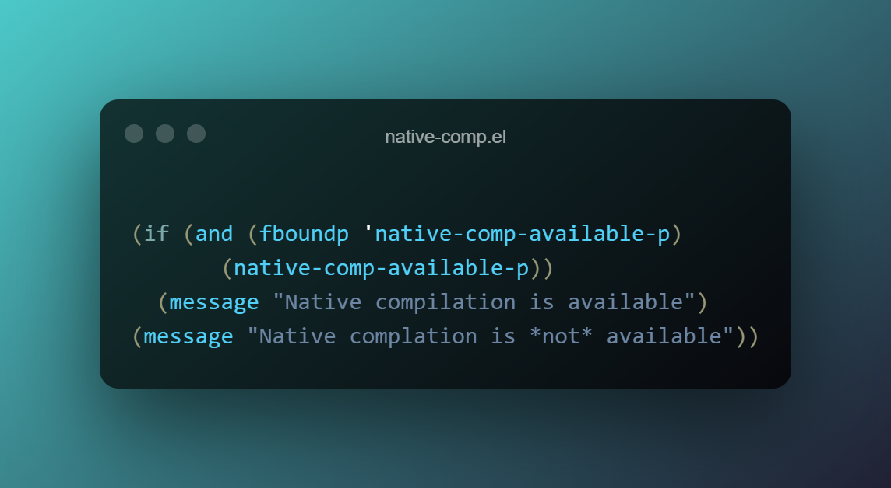

**Update:** As of 2021-04-25 GCC/Native-Comp has been [merged into master](https://lists.gnu.org/archive/html/emacs-devel/2021-04/msg01175.html). 
I'm sure package managers will be updated soon. 

## What is Emacs Native-Comp?
Emacs Native-Comp refers a to the `feature/native-comp` branch of Emacs. It adds support for compiling
EmacsLisp to native code using `libgccjit`. This provides a notable performance improvement right out
of the box. See [here](https://www.emacswiki.org/emacs/GccEmacs) for more details.

## Installing using Nix on WSL2

**Note**: All instructions below are sourced from this [gist](https://gist.github.com/mjlbach/179cf58e1b6f5afcb9a99d4aaf54f549). I'm sure the gist will be updated with changes more frequently than
this blog post.

To install it on WSL2, first you'll need to add the Emacs Community Overlay.
```bash
mkdir -p $HOME/.config/nixpkgs/overlays/emacs.nix
echo "import (builtins.fetchTarball {
      url = https://github.com/nix-community/emacs-overlay/archive/master.tar.gz;
    })" >> $HOME/.config/nixpkgs/overlays/emacs.nix
```

To avoid compiling from source, you'll need to configure Cachix support. This is essentially a "cache" of the 
pre-built binaries.
```bash
nix-env -iA cachix -f https://cachix.org/api/v1/install
cachix use nix-community
```

Next, install Emacs.
```bash
nix-env -iA nixpkgs.emacsGcc
```

## Checking if Native-Comp is working
To check if native compilation is available, fire up Emacs and evaluate the following elisp.
```lisp
(if (and (fboundp 'native-comp-available-p)
       (native-comp-available-p))
  (message "Native compilation is available")
(message "Native complation is *not* available"))
```
If you see "Native compilation is available", you're golden!

## Double checking if deferred compilation is set
This tells the native-comp system to generate natively compiled files every time Emacs loads a new `.elc`
file. 

As of this post, this should be enabled by default. However, to make sure, check that `comp-deferred-compilation` is set to true.

## A faster Emacs
A faster Emacs means we are one step closer to that ultimate developer environment paradise. Enjoy your speedy Emacs!
