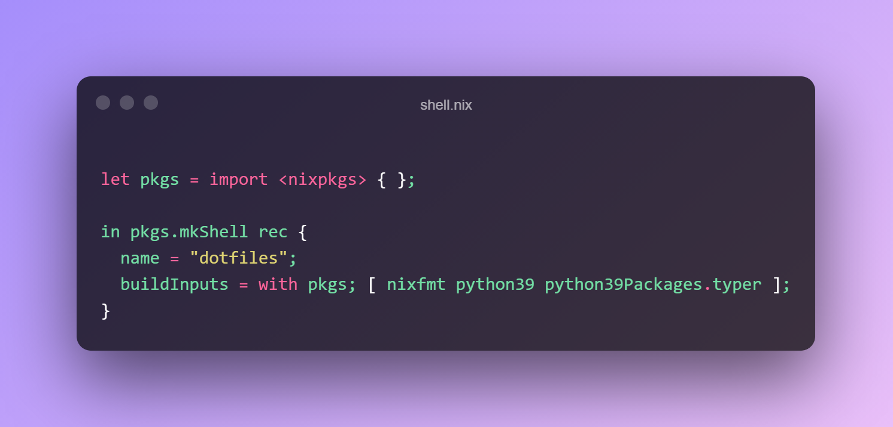

## Why have project specific packages?
There are a few reasons why you would want to have project specific packages.
- Different package versions per project e.g. you are maintaining a project that uses an old version of Node.js (like this blog, I'm lazy),
but use a newer version globally on your system.
- You don't want to pollute your global environment with packages you'll only use in an isolated project e.g. nixfmt to format *.nix files in my [dotfiles](https://github.com/rameezk/dotfiles).
- Easy on-boarding of a new team member e.g. packages are declared in the same project and it is easy to install and start contributing (more details coming below).

In the [Nix](https://nixos.org/) ecosystem, this can be achieved using [nix-shell](https://nixos.org/manual/nix/unstable/command-ref/nix-shell.html).

## Using nix shell
The command description reads.

_"start an interactive shell based on a Nix expression"_

Essentially, the command `nix-shell` will build the dependencies specified in a nix derivation, but **NOT** the derivation itself. 
It will then start an interactive shell which will have all the packages specified in the derivation available on your path.

Let's say you want Python 2.7 (why though?). You can try this out by running:
```sh
nix-shell -p python
```

Nix will then drop you into an interactive shell with Python 2.7 available to you. 

You can also specify your packages in a file. By default, `nix-shell` will look for a file `shell.nix` (or `default.nix` if it can't find that).

An example `nix.shell` might look something like this. 
```nix
let pkgs = import <nixpkgs> { };

in pkgs.mkShell rec {
  name = "dotfiles";
  buildInputs = with pkgs; [ nixfmt python39 python39Packages.typer ];
}
```

I use this to install packages only in my [dotfiles](https://github.com/rameezk/dotfiles) directory.
- nixfmt to format *.nix files
- Python and [Typer](https://github.com/tiangolo/typer) for nice CLI to handle re-building and rolling back my dotfiles (I'll write a dedicated blog post describing this setup)

To drop into an interactive shell, just run `nix-shell` without any arguments. Nix will now use `nix.shell` to install and put packages onto your path. 

Pretty nifty!

## Automating with direnv
Wouldn't it be cool if your interactive nix-shell could be activated every time you `cd` into your project directory (and deactivated when you `cd` out)?

Well, with [direnv](https://direnv.net/) you can.

You can install direnv with Nix.
```sh
nix-env -iA direnv
```

Then in each project you'd like to automate, create a `.envrc` file with the following:
```direnv
use_nix
```

Allow direnv to automatically "watch" this directory (and sub-directories) by running `direnv allow`.

Now, every time you `cd` into your project directory, `nix-shell` will automatically be run and you'll be dropped into an interactive shell. 

Cool!

## Conclusion

Nix and direnv provide a very convenient method of keeping your project specific packages away from your system packages as well as providing enough
autonomous convenience to "get out of your way". I use this methodology in a bunch of projects and it works really well.

It's worth mentioning [devshell](https://github.com/numtide/devshell), a project built specifically around this type of tooling. 
It provides a framework like experience describing this type of set up. It's worth checking out.

Till next time.
